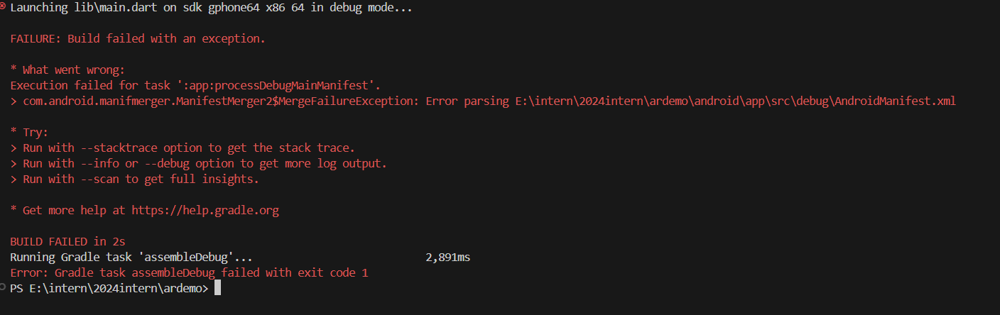

# 18 April 2024
## ทำอะไรมาก่อนหน้า
- ติดในส่วนที่เป็น AndroidManifest.xml
     ทดลอง implement AR ด้วย package `arcore_flutter_plugin`

    

## วันนี้ทำอะไร
### part 1
- implement Project ด้วย android stdio
      
    <video width="1920" height="560" controls>
    <source src="./ar_android – ar_earth_map_screen.dart [ar_android] 2567-04-18 10-32-25.mp4" type="video/mp4">
    </video>

### part 2
- ลองเปลี่่ยน lib เป็น `ar_flutter_plugin`
     
    
      
    <video width="1920" height="560" controls>
    <source src="./ar-app – home_screen.dart 2567-04-18 12-38-09.mp4" type="video/mp4">
    </video>

## ติดปัญหาอะไร
- FIX! `ar_flutter_plugin` เป็นpluginติดต่อกับ `arcore_flutter_plugin` และ `arkit_plugin` ใช้เดียวๆแล้ว ยังทำงานไม่ได้
     ไม่ได้แคปรูปตอนเกิดปัญหาไว้ (ลอง setup ตาม readme)