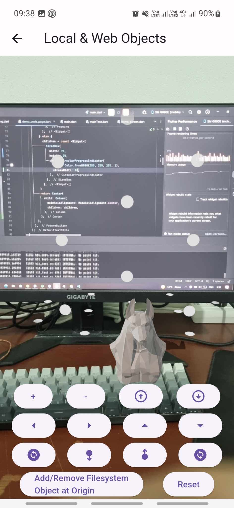

# 23 April 2024
## What did I do before
- ดึงโมเดลจาก web url มาไว้ใน local storage แล้วค่อยมาใช้
    <u>จะได้เพิ่มหน้าโหลดก่อนได้ง่าย</u> `Done`
- เพิ่มปุ่มที่จะขยับโมเดล `Done`
- เพิ่มปุ่มหมุนโมเดล `Done`
- เพิ่มปุ่มลดขยายโมเดล `Done`

## What did I do today
- create demo page for example
     
    
- create load <u>await</u> load model
     
    
- create error loading
     
    

## What problem do I have
- ยังไม่รู้ว่าต้องทำถึงไหน
- hard had
- viem
- docker?
- secure?
